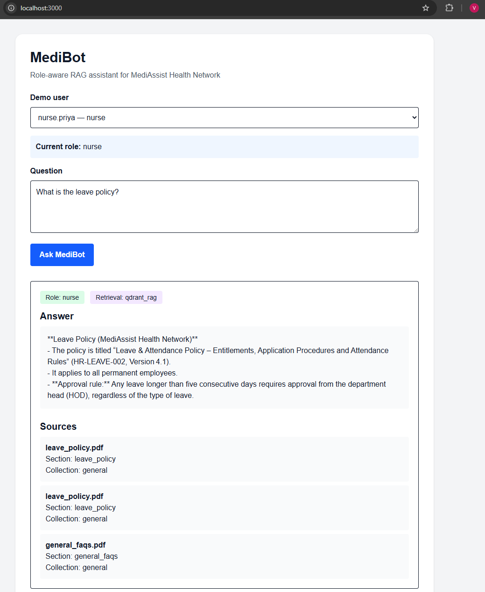
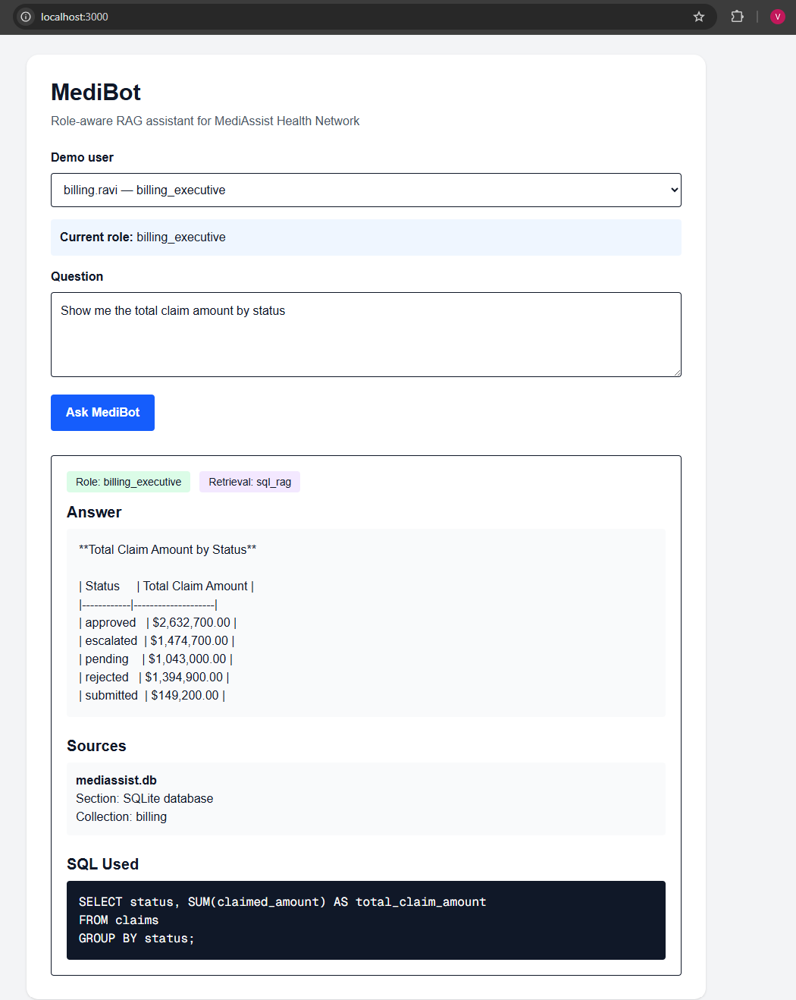
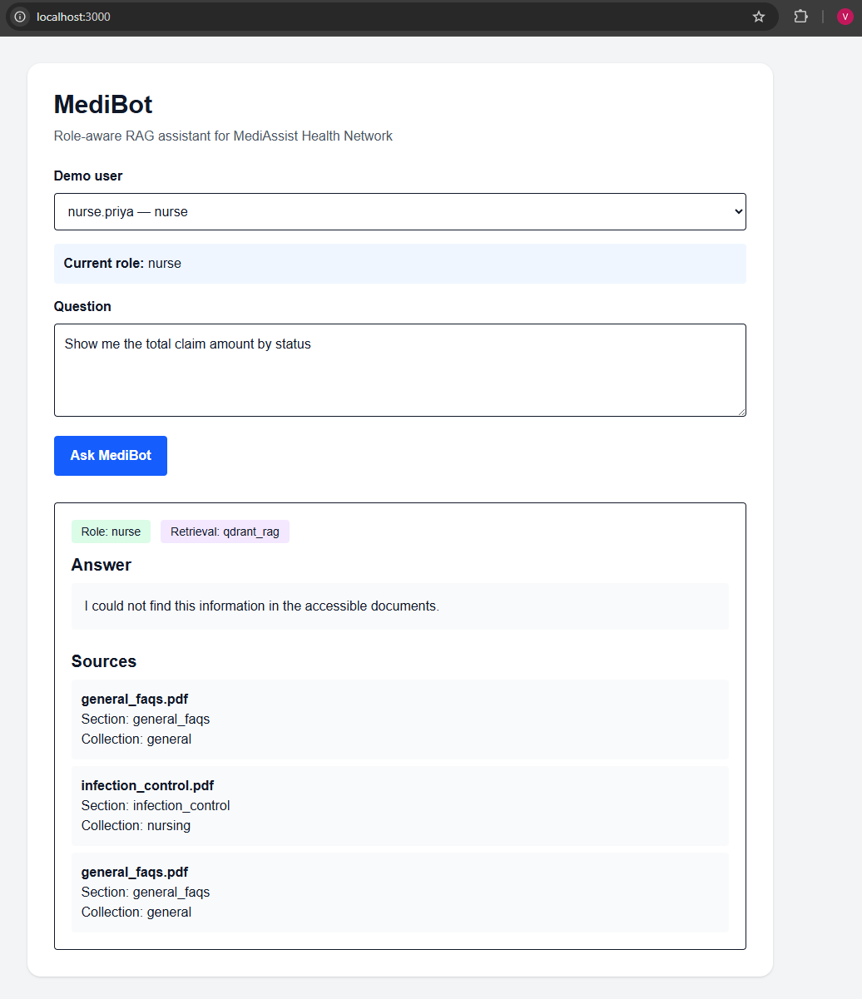

# MediBot: Role-Aware Advanced RAG Assistant

MediBot is a full-stack, role-aware RAG assistant built for the fictional MediAssist Health Network. It combines a FastAPI backend, Next.js frontend, Qdrant Cloud vector search, OpenAI embeddings, Groq LLM response generation, Docling-based PDF parsing, and SQLite SQL RAG.

The main goal of MediBot is to demonstrate secure retrieval-augmented generation where users only receive information allowed for their role. Doctors, nurses, billing executives, technicians, and admins can ask questions through the frontend, and the backend applies role-based access control before retrieving document chunks or SQL/database information.

---

## Key Features

* Full-stack role-aware RAG assistant
* FastAPI backend API
* Next.js frontend interface
* Qdrant Cloud vector retrieval
* OpenAI `text-embedding-3-small` embeddings
* Groq LLM-based answer generation
* Docling PDF parsing with HybridChunker
* `pypdf` fallback parsing for PDFs
* SQLite SQL RAG for billing and database-style questions
* Retrieval-time RBAC filtering using Qdrant metadata filters
* SQL access restricted to `billing_executive` and `admin`
* Frontend display of answer, role, retrieval type, sources, and SQL query when allowed
* Qdrant payload index creation for metadata filtering
* Demo test cases for allowed and blocked access

---

## Tech Stack

### Backend

* Python
* FastAPI
* LangChain
* Qdrant Cloud
* OpenAI embeddings
* Groq
* Docling
* pypdf
* SQLite
* Uvicorn

### Frontend

* Next.js
* React
* JavaScript
* Tailwind CSS
* Fetch API

---

## Project Structure

```text
medibot-project/
├── backend/
│   ├── app/
│   │   ├── auth.py
│   │   ├── config.py
│   │   ├── ingestion.py
│   │   ├── main.py
│   │   ├── rag.py
│   │   ├── rbac.py
│   │   ├── schemas.py
│   │   └── sql_rag.py
│   ├── data/
│   │   └── mediassist_data/
│   ├── create_qdrant_indexes.py
│   ├── requirements.txt
│   ├── run_ingestion.py
│   ├── test_rag.py
│   └── test_sql_rag.py
├── frontend/
│   ├── app/
│   │   ├── globals.css
│   │   ├── layout.js
│   │   └── page.js
│   ├── public/
│   ├── package.json
│   └── README.md
├── screenshots/
│   ├── nurse-leave-policy.png
│   ├── billing-sql-rag.png
│   └── nurse-sql-blocked.png
├── .gitignore
└── README.md
```

---

## Role-Based Access Control

MediBot restricts both document retrieval and SQL access based on the selected user role.

| Role                | Allowed Document Collections                             |
| ------------------- | -------------------------------------------------------- |
| `doctor`            | `general`, `clinical`, `nursing`                         |
| `nurse`             | `general`, `nursing`                                     |
| `billing_executive` | `general`, `billing`                                     |
| `technician`        | `general`, `equipment`                                   |
| `admin`             | `general`, `clinical`, `nursing`, `billing`, `equipment` |

SQL RAG is only allowed for:

```text
billing_executive
admin
```

Unauthorized roles, such as `nurse`, cannot access SQL/database results.

---

## Dataset Collections

The dataset is stored in:

```text
backend/data/mediassist_data
```

Expected folder structure:

```text
backend/data/mediassist_data/
├── billing/
├── clinical/
├── db/
├── equipment/
├── general/
└── nursing/
```

SQLite database path:

```text
backend/data/mediassist_data/db/mediassist.db
```

---

## Metadata Attached to Every Chunk

Each indexed document chunk includes metadata used for source display and RBAC filtering.

```text
source_document
collection
access_roles
section_title
chunk_type
chunk_index
parser
```

The backend filters Qdrant retrieval using:

```text
metadata.collection
```

Because of this, Qdrant payload indexes must be created after ingestion.

---

## Architecture Diagram

```text
                          +----------------------+
                          |      Demo User       |
                          | doctor / nurse /     |
                          | billing / tech /     |
                          | admin                |
                          +----------+-----------+
                                     |
                                     v
                          +----------------------+
                          |   Next.js Frontend   |
                          | Role Selection UI    |
                          | Chat Interface       |
                          +----------+-----------+
                                     |
                                     v
                          +----------------------+
                          |   FastAPI Backend    |
                          | /login /chat         |
                          | /collections         |
                          +----------+-----------+
                                     |
                                     v
                          +----------------------+
                          |      RBAC Layer      |
                          | Role-based access    |
                          | control filtering    |
                          +----------+-----------+
                                     |
                    +----------------+----------------+
                    |                                 |
                    v                                 v
      +----------------------------+    +----------------------------+
      | Document / Policy Query    |    | Billing / Database Query  |
      +-------------+--------------+    +-------------+--------------+
                    |                                 |
                    v                                 v
      +----------------------------+    +----------------------------+
      |      Qdrant RAG            |    |        SQL RAG             |
      | Qdrant Cloud Vector DB     |    | SQLite (mediassist.db)     |
      | OpenAI Embeddings          |    | Only billing/admin roles   |
      | Role-filtered retrieval    |    | can access SQL results     |
      +-------------+--------------+    +-------------+--------------+
                    |                                 |
                    +----------------+----------------+
                                     |
                                     v
                          +----------------------+
                          |   Groq LLM Answer    |
                          | Response Generation  |
                          +----------+-----------+
                                     |
                                     v
                          +----------------------+
                          | Frontend Response UI |
                          | Answer               |
                          | Sources              |
                          | Retrieval Type       |
                          | SQL if allowed       |
                          +----------------------+

Document Ingestion Flow
-----------------------
PDF / Markdown Files
        |
        v
Docling / pypdf Parsing
        |
        v
Chunking + Metadata
        |
        v
OpenAI Embeddings
        |
        v
Qdrant Collection: medibot_docs
        |
        v
create_qdrant_indexes.py
```

> **Important:** After running `python run_ingestion.py`, run `python create_qdrant_indexes.py` before starting the backend. This creates the required Qdrant payload indexes for filters such as `metadata.collection`.

---

## Environment Variables

Create this file:

```text
backend/.env
```

Example:

```env
GROQ_API_KEY=your_groq_api_key_here
GROQ_MODEL=openai/gpt-oss-20b

OPENAI_API_KEY=your_openai_api_key_here

QDRANT_URL=your_qdrant_cloud_url_here
QDRANT_API_KEY=your_qdrant_api_key_here
QDRANT_COLLECTION=medibot_docs

HF_TOKEN=your_huggingface_token_optional

DATA_DIR=data/mediassist_data
DB_PATH=data/mediassist_data/db/mediassist.db
```

Do not commit real API keys.

Optional frontend file:

```text
frontend/.env.local
```

Example:

```env
NEXT_PUBLIC_API_BASE_URL=http://127.0.0.1:8000
```

The current frontend can also directly use `http://127.0.0.1:8000` during local development.

---

## Backend Setup

Go to the backend folder:

```bash
cd backend
```

Create a virtual environment:

```bash
python -m venv venv
```

Activate it on Windows CMD:

```cmd
venv\Scripts\activate.bat
```

Activate it on Windows PowerShell:

```powershell
.\venv\Scripts\Activate.ps1
```

If PowerShell blocks activation, run:

```powershell
Set-ExecutionPolicy -Scope Process -ExecutionPolicy Bypass
.\venv\Scripts\Activate.ps1
```

Install dependencies:

```bash
python -m pip install -r requirements.txt
```

---

## Ingest Documents into Qdrant

From the backend folder:

```bash
python run_ingestion.py
```

This parses the MediAssist documents, creates chunks, attaches metadata, and indexes them into Qdrant Cloud.

After ingestion, create Qdrant payload indexes:

```bash
python create_qdrant_indexes.py
```

This step is required because the backend filters retrieval using metadata fields such as:

```text
metadata.collection
```

Important: when ingestion uses `force_recreate=True`, the Qdrant collection is recreated and payload indexes are removed. Run `create_qdrant_indexes.py` after every full re-ingestion.

---

## Run Backend

From the backend folder:

```bash
python -m uvicorn app.main:app --reload
```

Backend runs at:

```text
http://127.0.0.1:8000
```

Swagger API docs:

```text
http://127.0.0.1:8000/docs
```

Health check:

```text
http://127.0.0.1:8000/health
```

Expected response:

```json
{
  "status": "ok",
  "message": "MediBot backend is running"
}
```

---

## Frontend Setup

Open a second terminal and go to the frontend folder:

```bash
cd frontend
```

Install dependencies:

```bash
npm install
```

Run the frontend:

```bash
npm run dev
```

If PowerShell blocks npm scripts, use:

```powershell
npm.cmd run dev
```

Frontend runs at:

```text
http://localhost:3000
```

Use `http://localhost:3000` for local testing.

---

## Important Run Order

Run the project in this order:

1. Ingest documents into Qdrant
2. Create Qdrant payload indexes
3. Start the FastAPI backend
4. Start the Next.js frontend

Backend commands:

```bash
cd backend
python run_ingestion.py
python create_qdrant_indexes.py
python -m uvicorn app.main:app --reload
```

Frontend commands in a second terminal:

```bash
cd frontend
npm install
npm run dev
```

---

## Running the Full App Locally

Use two terminal windows.

### Terminal 1: Backend

```cmd
cd C:\Users\kudap\medibot-project\backend
venv\Scripts\activate.bat
python -m uvicorn app.main:app --reload
```

### Terminal 2: Frontend

```powershell
cd C:\Users\kudap\medibot-project\frontend
npm.cmd run dev
```

Open:

```text
http://localhost:3000
```

---

## Demo Users

| Username       | Password     | Role                |
| -------------- | ------------ | ------------------- |
| `dr.mehta`     | `doctor`     | `doctor`            |
| `nurse.priya`  | `nurse`      | `nurse`             |
| `billing.ravi` | `billing`    | `billing_executive` |
| `tech.anand`   | `technician` | `technician`        |
| `admin.sys`    | `admin`      | `admin`             |

These users are for local demo purposes only.

---

## API Endpoints

### Health Check

```text
GET /health
```

Returns backend status.

### Login

```text
POST /login
```

Example request:

```json
{
  "username": "nurse.priya",
  "password": "nurse"
}
```

### Chat

```text
POST /chat
```

Example request:

```json
{
  "question": "What is the leave policy?",
  "role": "nurse"
}
```

Example curl test:

```cmd
curl -X POST http://127.0.0.1:8000/chat -H "Content-Type: application/json" -d "{\"question\":\"What is the leave policy?\",\"role\":\"nurse\"}"
```

### Role Collections

```text
GET /collections/{role}
```

Example:

```text
GET /collections/nurse
```

---

## RAG Flow

```text
User selects demo role
        ↓
User asks question in Next.js frontend
        ↓
Frontend sends request to FastAPI /chat
        ↓
Backend checks role permissions
        ↓
If billing/database question:
    SQL RAG is used only for billing_executive or admin
        ↓
Otherwise:
    Qdrant retrieval runs with RBAC metadata filter
        ↓
Allowed chunks are retrieved
        ↓
Chunks are reranked
        ↓
Groq generates answer from allowed context
        ↓
Frontend displays answer, retrieval type, sources, and SQL if allowed
```

---

## Demo Test Cases

### 1. Qdrant RAG Test

Role:

```text
nurse
```

Question:

```text
What is the leave policy?
```

Expected result:

* Retrieval type: `qdrant_rag`
* Sources include `leave_policy.pdf`
* Sources are only from collections allowed for nurse, such as `general` and `nursing`

---

### 2. Doctor Clinical RAG Test

Role:

```text
doctor
```

Question:

```text
What medicines are listed in the drug formulary?
```

Expected result:

* Retrieval type: `qdrant_rag`
* Sources include `drug_formulary.pdf`
* Sources come from the `clinical` collection

---

### 3. SQL RAG Allowed Test

Role:

```text
billing_executive
```

Question:

```text
Show me the total claim amount by status
```

Expected result:

* Retrieval type: `sql_rag`
* Source includes `mediassist.db`
* SQL query is shown in the frontend
* Claim totals are displayed

---

### 4. SQL RAG Blocked Test

Role:

```text
nurse
```

Question:

```text
Show me the total claim amount by status
```

Expected result:

* SQL data is not exposed
* No claim totals are shown
* `mediassist.db` is not returned as a source
* The response indicates that database information is not accessible for the role

---

## Screenshots

Screenshots are stored in:

```text
screenshots/
```

### Nurse Leave Policy



### Billing Executive SQL RAG



### Nurse SQL Blocked



---

## Troubleshooting

### Backend is not reachable

Check:

```cmd
curl http://127.0.0.1:8000/health
```

If it fails, start the backend:

```cmd
cd backend
venv\Scripts\activate.bat
python -m uvicorn app.main:app --reload
```

### Frontend says it cannot connect to backend

Make sure backend is running first, then start frontend.

Use:

```text
http://localhost:3000
```

for the frontend and:

```text
http://127.0.0.1:8000
```

for the backend.

### Qdrant says payload index is missing

If you see an error like:

```text
Index required but not found for "metadata.collection"
```

Run:

```cmd
python create_qdrant_indexes.py
```

Then restart the backend.

### Re-ingestion completed but retrieval fails

Run the commands in this order:

```cmd
python run_ingestion.py
python create_qdrant_indexes.py
python -m uvicorn app.main:app --reload
```

### PowerShell blocks venv or npm

For backend venv activation:

```powershell
Set-ExecutionPolicy -Scope Process -ExecutionPolicy Bypass
.\venv\Scripts\Activate.ps1
```

For frontend:

```powershell
npm.cmd run dev
```

---

## Security Notes

* Do not commit `.env` or `.env.local` files.
* Do not commit real API keys.
* Do not commit `node_modules`, `.next`, `venv`, or `__pycache__`.
* SQL RAG only allows safe `SELECT`-style access.
* SQL RAG is restricted to `billing_executive` and `admin`.
* Qdrant retrieval uses role-based metadata filters.
* Demo credentials are not production authentication.

Recommended `.gitignore` entries:

```gitignore
.env
.env.local
.env.*.local
node_modules/
.next/
venv/
__pycache__/
*.pyc
```

Use caution before committing local database files such as:

```text
backend/data/mediassist_data/db/mediassist.db
```

Only commit demo data if it contains no real or sensitive information.

---

## Project Status

Completed:

* Backend API
* Frontend UI
* Role-based demo users
* RBAC collection filtering
* Qdrant document retrieval
* Qdrant payload index creation
* SQL RAG
* SQL role restriction
* Source display
* Retrieval type display
* SQL display when allowed
* Demo test cases
* Screenshots

Future improvements:

* Add production authentication
* Add deployed frontend/backend URLs
* Move frontend API URL fully to environment configuration
* Add full hybrid dense + sparse Qdrant retrieval
* Add cross-encoder reranking
* Add automated tests for RBAC and SQL blocking
* Add Docker setup

---

## Project Highlights

* Built a role-aware full-stack RAG assistant using FastAPI, Next.js, Qdrant Cloud, OpenAI embeddings, Groq, Docling, and SQLite.
* Implemented retrieval-time RBAC so each role only accesses permitted document collections.
* Added SQL RAG support for billing/database queries with access restricted to `billing_executive` and `admin`.
* Displayed answers, source documents, retrieval type, and SQL queries in the frontend.
